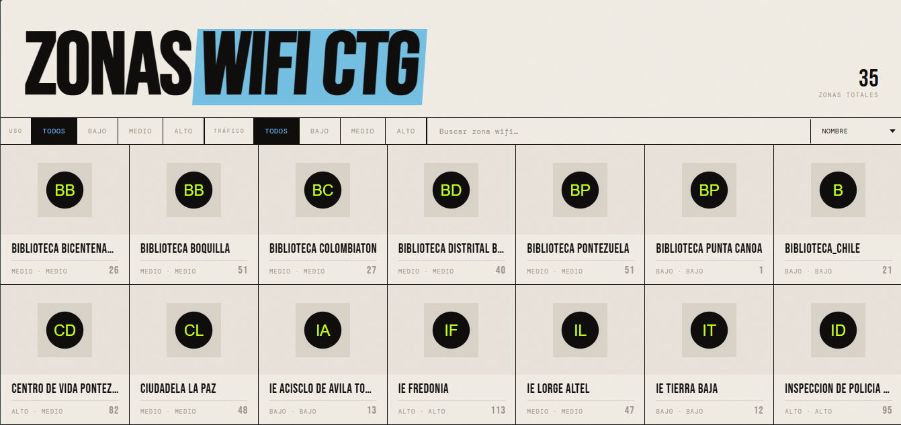
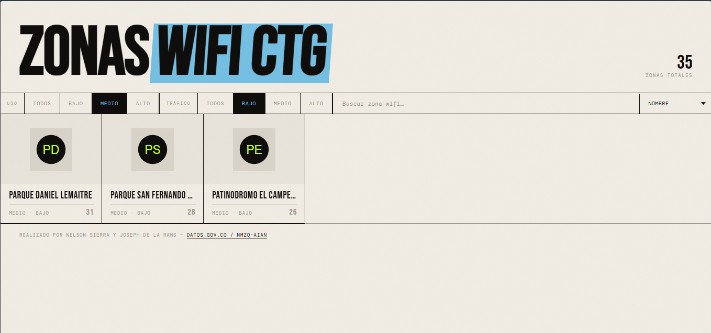
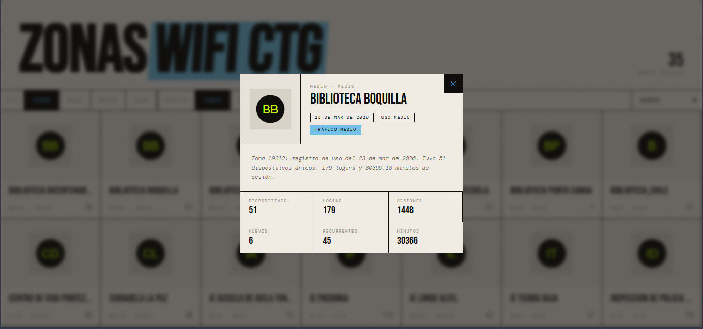
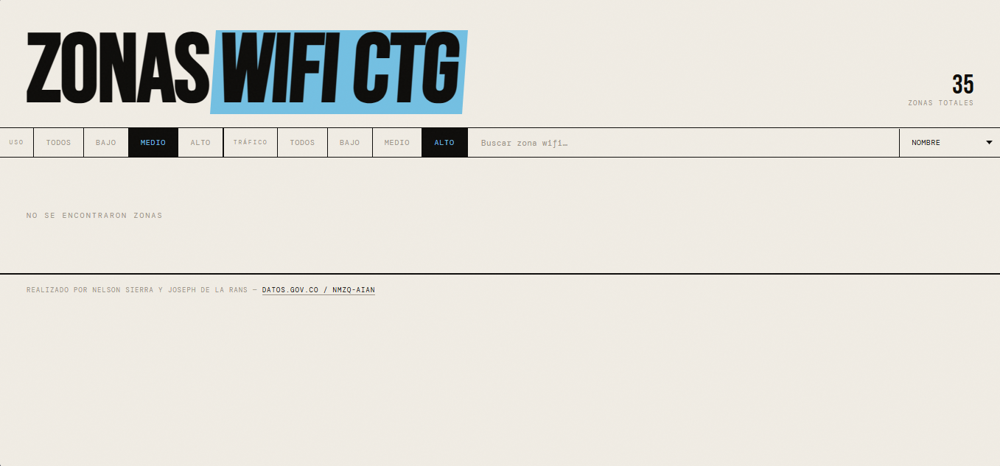

# Zonas Wifi CTG

Aplicación web estática para consultar y visualizar las zonas WiFi de Cartagena a partir de los datos abiertos de [datos.gov.co](https://www.datos.gov.co/resource/nmzq-aian.json).

## Descripción

Este proyecto carga la información más reciente disponible desde la API SODA2, calcula los indicadores principales de cada zona y los presenta en una interfaz visual con tarjetas, filtros, ordenamiento, búsqueda y un modal de detalle.

## Funcionalidades

- Carga automática de la última fecha disponible en la API.
- Visualización de zonas en tarjetas con conteo de dispositivos únicos.
- Filtros por nivel de uso y tráfico.
- Búsqueda por nombre de zona.
- Ordenamiento por nombre, dispositivos, logins y tiempo de sesión.
- Modal con información ampliada de cada zona.
- Estados de carga y vacío.

## Tecnologías

- HTML5
- CSS3
- JavaScript vanilla
- API pública de datos abiertos

## Estructura

- `index.html`: estructura principal de la interfaz.
- `styles.css`: estilos visuales y layout responsivo.
- `app.js`: consumo de API, lógica de filtros y renderizado.

## Requisitos

Solo necesitas un navegador moderno y acceso a internet para consumir la API.

## Cómo ejecutar

### Opcion 1: abrir directo

1. Abre [Pagina](https://nessisx.github.io/API-SODA/) en el navegador.

### Opcion 2: servidor local con Python

1. En la raiz del proyecto, ejecuta:
   python -m http.server 5500
2. Abre:
   http://localhost:5500

### Opcion 3: VS Code + Live Server

1. Instala la extension Live Server.
2. Click derecho en [index.html](index.html) y selecciona Open with Live Server.

## Documentación visual

#### Pantalla principal

#### Filtros y búsqueda

#### Modal de detalle

#### Estado sin resultados

## Fuente de datos

Los datos provienen de la API pública:

https://www.datos.gov.co/resource/nmzq-aian.json

## Autores

Proyecto realizado por Nelson Sierra y Joseph De la Rans.
